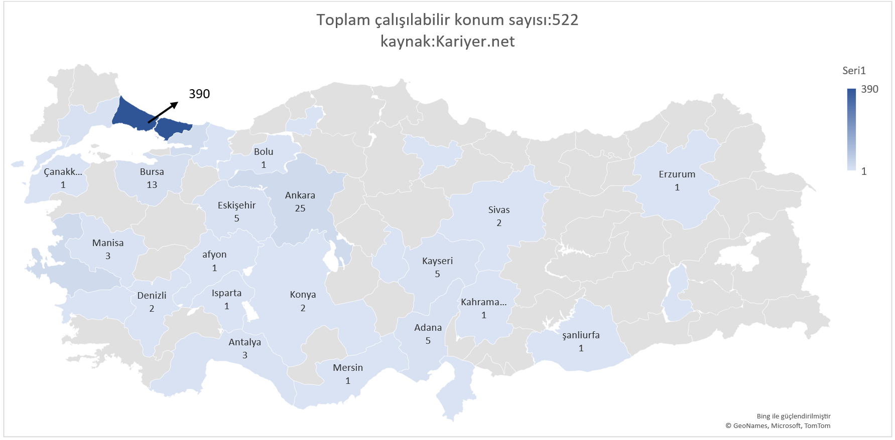
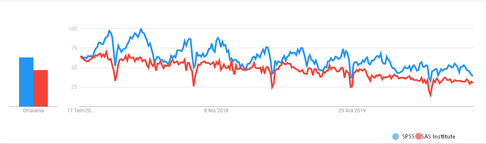

```{r include=FALSE}
knitr::opts_chunk$set(
  warning = FALSE,
  message = FALSE
)

```

```{css eval=FALSE, include=FALSE}

#metinlerin-temizlenmesi {
  display:none;
}


```

# Önsöz


Bu bitirme projesinin amacı istatistik bölümü mezunlarına ,öğrencilerine ve istatistik bölümünü tercih etmeyi düşünen adaylar için özel sektör'ün beklentileri hakkında bilgi verebilmektir. Pek tabi veri analitiği alanında kariyer yapmayı düşünen diğer mühendislik veya fen bölümü öğrencileri içinde faydalı olacağını düşünmekteyim.\
\
Analiz metnini okumadan önce analize ilişkin şahsi eleştirilerimi paylaşmak isterim. Analiz edilecek iş ilanları resmin büyük parçasını kaybetmemek adına pozisyon bazlı olarak değil sadece istatistik keyword'ünün bulunması üzerinden oluşturuldu. Veri üzerinde daha sonrasında istatistik bölümü öğrencilerinin yeteneklerine çok uzak olan veya anlamsız olan iş ilanları elle temizlendi. Bununla beraber veriseti tek bir kaynak(kariyer.net) vasıtasıyla üretilmiştir. Bu durumlar sebebiyle analizde bahsedilen yeteneklere ait frekansların sektörel bazda gerçeği tam anlamıyla yansıtmadığı söylenebilir. Yine de okuyucuya özel sektör ile alakalı yeni bir bakış açısı kazandıracaktır.

Analiz'in teknik tarafında veri kazıma ve model oluşturma aşamaları Python üzerinden yapıldı. Verinin temizlenmesi ve raporun oluşturulması aşamasında ise R dili tercih edildi. El ile yapılması gereken işlemler ve harita grafiği ise Excel üzerinden oluşturulmuştur.\
\
Analizin son aşaması olan kümeleme analizinde çok daha başarılı modellemeler ve yöntemler tercih edilebilir. Ayrıca İş ilanlarında aranan özellikler için NLP yöntemleri örnek olarak Phrase extraction tercih edilerek bilinmeyen çok daha fazla bilgi aydınlığa kavuşturulabilir.\

Bu projeyi destekleyen ve veri sponsoru olan **Kariyer.net’e**, projeye olan yaklaşımları ve geri dönüşleri için Proje danışmanım olan **Doç.Dr. Fatih Kızılaslan’a**, Projenin kümeleme ayağının gerçekleşmesinde inkar edilemez katkısından ötürü bölüm arkadaşım olan **Harun Kührevi**'ye ve teşekkür ederim. Özel olarak  **Prof.Dr Esra Akdeniz’e** eğitim hayatımda bana olan destekleri ve yön göstericiliği sebebiyle sonsuz teşekkürlerimi belirtmek isterim.


# Giriş

Kariyer.net üzerindeki ilanları python üzerinde selenium kütüphanesi ile çekildi. Daha sonrasında excel üzerinden el ile veri analitiği ile alakasız veya istatistik mezunlarının girme şansı olmayan/girmek istemeyeceği ilanları düşürüldü. Toplam veri sayısı 717 den 496 adet ilana düşürülmüştür. Bu işlemin yapılma sebebi +400 adet olan eşsiz pozisyon isimlerini daha kolay bir biçimde üst gruplara alabilmek ve daha tutarlı sonuçlar elde etmektir.

Buna ek olarak **pozisyon kısa** adı altında ilanlar belirli başlı niteliklere göre gruplandırılmıştır.

1.  veri analisti(iş zekası, veri analitiği, veri bilimci ,dijital reklamcılık sektör veya tittlelarına aitilanlar)

2.  finans analisti(finans sektörü hakkında bilgi gerektiren analist pozisyonları)

3.  develoaper(herhangi bir sektörde yazılım-it-bilgi işlem tarafındaki pozisyonlar

4.  iş analisti(finans analistine benzer şekilde genel anlamda yapılan iş ile alakalı analist pozisyonuna sahip pozisyonlar)

5.  insan kaynaklari (çoğunlukla ik işleri olmak üzere az sayıda personel ile ilgilenen pozisyonlar

6.  ticaret uzmanı(çoğunlukla evrak işleri, ithalat, ihracat ve satış pozisyonlarında uzmanlık gösteren pozisyonlar)

7.  Muhasebe

Bazı ilanlar pek çok pozisyona yakın davranmasından dolayı en yakın seçenek tercih edilmiştir.

# Tanımlayıcı bilgiler

```{r librarys}

library(readr)
library(readxl)
library(tm)
library(htmltools)
library("gridExtra")
library(tidyverse)
library(arsenal)
library("cowplot")
filter<-dplyr::filter
select<-dplyr::select
library(stringr)

```

```{r}
#verinin okutulması ve çakışan ilan durumu için unique ile temizlenmesi. 
mainDF <- read_excel("mainDF.xlsx")
mainDF<-unique(mainDF)
mainDF %>% filter(!grepl("QUALIFICATIONS AND JOB DESCRIPTION",metin))->mainDF
```

# Kaç farklı pozisyon vardır ve en çok tekrar edenler hangileridir?

Toplam `r length(unique(mainDF$pozisyon))` adet essiz isimli pozisyon bulunmaktadir.

```{r}
mainDF %>% 
  group_by(pozisyon) %>% 
  summarise(frekans=n()) %>%
  arrange(-frekans) %>% 
  slice(1:10) %>% 
  rename_with(Hmisc::capitalize) %>% 
  kableExtra::kable()

```

Görüldüğü gibi frekans sayıları benzer işlerin farklı sayılarla belirtilmesi sebebiyle azdır.Kısaltılmış ilanların frekans tablosu aşağıda verilmiştir.

```{r}
mainDF %>% 
  group_by(pozisyon_kisa) %>% 
  summarise(frekans=n()) %>% 
  arrange(-frekans) %>%
  rename(`indirgenmiş pozisyon`=pozisyon_kisa)%>%
  rename_with(Hmisc::capitalize) %>% 
  kableExtra::kable()
```

```{r}
mainDF %>%
  group_by(pozisyon_kisa) %>%
  summarise(frekans=n()) %>%
  arrange(-frekans) %>% 
  rename(`indirgenmiş pozisyon`=pozisyon_kisa) %>%
  ###plot asamasi
  ggplot(.,aes(x=reorder(`indirgenmiş pozisyon`, -frekans),y=frekans))+
  geom_bar(stat = "identity",col='white',fill='#159957')+
  labs(x='Pozisyonlar',
  title ='İndirgenmiş ilanların frekansları tablosu',
  y='Frekans')+
  theme_classic()


```

Beklenildiği üzere istatistik anahtar kelimeli ilanlarlarda analist pozisyonların ön sıralarda olduğunu, diğer meslek dallarında daha az ön planda olduğunu görmekteyiz. Finans sektörünün tek başına yüksek miktarda analist barındırdığı görülebilmektedir.

Bu kısım indirgemenin bir yan etkisi olarak net yorumlarda bulunulmasını engellemektedir. Bu sebeple sektör ve departmanları inceleyerek daha iyi bir öngörü elde edilmeye çalışılmıştır.

# Departman dağılımı ve sektörel dağılım

Kariyer.net ilanlara ait sektör ve departman bilgilerini de sunmakta, bu sayede iş ilanlarının hangi sektör ve departmanda daha çok yoğunlaştığı aşağıda tablo ve grafiklerle gösterilmiştir.

```{r}
mainDF %>% group_by(`Departman:`) %>% mutate(`Departman:`=tolower(`Departman:`)) %>% summarise(frekans=n()) %>% arrange(-frekans) %>% filter(frekans>5)->freqDepartmanDF

mainDF %>%
  group_by(`Firma Sektörü:`) %>%
  mutate(`Firma Sektörü:` = tolower(`Firma Sektörü:`))  %>%
  select(`Firma Sektörü:`) %>%
  summarise(frekans = n()) %>%
  arrange(-frekans) %>%
  filter(frekans >5) ->freqSektorDF
```

```{r,results='asis'}
knitr::kable(freqDepartmanDF,
             caption = '**Departman ait frekans tablosu**')

knitr::kable(freqSektorDF,
             caption = '**Sektörlere ait frekans tablosu**')
```

```{r}
library(cowplot)

mainDF %>% 
  group_by(`Departman:`) %>%
  mutate(`Departman:`=tolower(`Departman:`)) %>%
  summarise(frekans=n()) %>% arrange(-frekans) %>%
  filter(frekans>5) %>%
  ggplot(.,aes(x=reorder(`Departman:`, frekans),y=frekans))+
 scale_y_continuous(breaks=seq(0,70,5))+
  geom_bar(stat = "identity",col='white',fill='#159957')+
  labs(x='Deparmanlar')+
  theme_classic()+
  coord_flip()->departmanPlot

freqSektorDF %>%
  mutate(`Firma Sektörü:`=ifelse(is.na(`Firma Sektörü:`),'bilinmiyor',`Firma Sektörü:`)) %>% 
  ggplot(.,aes(x=reorder(`Firma Sektörü:`, frekans),y=frekans))+
  geom_bar(stat = "identity",col='white',fill='#159957')+
  labs(x='Sektörler')+
  theme_classic()+
  scale_y_continuous(breaks=seq(0,70,5))+
  coord_flip()->sektorPlot

cowplot::ggdraw() + 
  draw_label(
    "Departman ve sektörlere göre istihdam istatistikleri",
    fontface = 'bold',
    x = 0,
    hjust = 0
  ) +
  theme(
    # add margin on the left of the drawing canvas,
    # so title is aligned with left edge of first plot
    plot.margin = margin(0, 0, 0, 7)
  )->title


plot_row<-cowplot::plot_grid(departmanPlot, sektorPlot)
cowplot::plot_grid(title,plot_row,nrow=2,
                   rel_heights = c(0.1, 1))
```

Bilgi teknolojileri/it, planlama ve finans alanı, en çok istihdam sağlayan departmanlardır .Sektörel anlamda ise bankacılık,perakende ve bilişim sektörü istatistik mezunlarına en çok istihdam sağlayan 3 sektördür. Bu sonuç, istatistik mezunlarının gün geçtikçe daha fazla bilgisayar ve yazılım teknolojileri ile iç içe çalıştğını göstermektedir.

Sektörel anlamda en çok istihdamın finans/bankacılık sektörü olduğu gözden kaçmamalıdır.

# İş ilanlarının konumları

iş ilanlarının konumlarında istanbul'un avrupa ve anadolu yakaları 2 ayrı yer sayılırken kalan illerde herhangi bir değişiklik yapılmayacaktır.

Ayrıca bazı iş ilanlarında birden fazla konum olması, her bir bölgeyi ekstra sayılabileceği anlamına gelmektedir.Bu sebeple ilan sayısından daha fazla sayıda vilayet bulunmuş olmaktadır.

```{r}
#Harita grafiği excel'den eklenecektir.R üzerinde bu grafiğin özelleştirmesi problemlidir.
old1 <- "çğşıüöÇĞŞİÖÜ"
new1 <- "cgsiuocgsiou" 
```

```{r}
library(stringr)
 parantezsil<-function(x)gsub("\\s*\\([^\\)]+\\)","",as.character(x))


gsub("İstanbul(Avr.)", "istanbul", mainDF$city , fixed=TRUE)%>%
  gsub("İstanbul(Asya)","istanbul",.,fixed =TRUE ) %>% 
  gsub("İzmir","izmir",.,fixed =TRUE ) %>% 
  parantezsil() %>%
  gsub(" ","",.,fixed = TRUE) %>% 
  strsplit(",") %>% 
  lapply(., function(x)x[!duplicated(x)]) %>% 
  unlist() %>% 
  gsub(" ","",.) %>% 
  tolower() %>%
  table() %>%
  data.frame() %>% 
  rename(il=1,frekans='Freq') %>% 
  arrange(il)->ilFreqDF
 
ilFreqDF %>% kableExtra::kable()
   
```



<!-- # ```{r} -->

<!-- # TUR <- readRDS("TUR_adm1.rds") -->

<!-- # TUR$NAME_1 %>% sort() %>% tolower()->TR -->

<!-- # case_when( -->

<!-- #    TR %in% "nevsehir"~"nevşehir", -->

<!-- #    TR %in% "aydin"~"aydın", -->

<!-- #    TR %in% 'eskisehir' ~ 'eskişehir', -->

<!-- #    TR %in% 'k. maras' ~ 'kahramanmaraş', -->

<!-- #    TR %in% 'sanliurfa' ~ 'şanlıurfa', -->

<!-- #    TR %in% 'tekirdag' ~ 'tekirdağ', -->

<!-- #    !(TR%in%c('eskişehir','kahramanmaraş','şanlıurfa','tekirdağ','nevşehir','aydın'))~TR -->

<!-- #  -->

<!-- # )->TR -->

<!-- # TUR$NAME_1<-TR -->

<!-- # ``` -->

<!-- #  -->

<!-- # ```{r} -->

<!-- # fortify(TUR) -> TUR_for -->

<!-- # id_and_cities_ist <- data_frame(id = rownames(TUR@data), -->

<!-- #                                 'il' = TUR@data$NAME_1) %>% -->

<!-- #   left_join(ilFreqDF, by = "il")  -->

<!-- # final_ist_map <- left_join(TUR_for, id_and_cities_ist, by = "id") -->

<!-- # ``` -->

<!-- #  -->

<!-- # ```{r} -->

<!-- # library(mapproj) -->

<!-- # ggplot(final_ist_map) + -->

<!-- #   geom_polygon( aes(x = long, y = lat, group = group, fill = frekans), -->

<!-- #                 color = "grey") + -->

<!-- #   coord_map() + -->

<!-- #   theme_void() +  -->

<!-- #   labs(title = "2021 haziran ayı istatistik mezunlarına uygun iş ilanlarının konumları", -->

<!-- #        subtitle = paste0("Toplam çalışılabilir konum sayisi: ", sum(ilFreqDF$frekans)), -->

<!-- #        caption = "Veri Kaynağı: kariyer.net") + -->

<!-- #   scale_fill_distiller(palette = 'Reds', -->

<!-- #                        direction = 1, -->

<!-- #                          type = "seq", -->

<!-- #                        name = "illere göre ilan frekansı", -->

<!-- #                        limits = c(0,400), na.value = "white") + -->

<!-- #   theme(plot.title = element_text(hjust = 0.05), -->

<!-- #         plot.subtitle = element_text(hjust = 0.05)) -->

iş ilanlarının çoğunluğu incelendiğinde ağırlıklı olarak istanbulun iş havuzunun çok yüksek bir kısmını barındırdığı görülebilir. Finans,it,arge sektörlerinin çoğunlukla istanbulda yoğunlaşması bu sonucun nihai sebebidir.

```{r}
gsub("İstanbul(Avr.)", "istanbul.avrupa", mainDF$city , fixed=TRUE)%>%
  gsub("İstanbul(Asya)","istanbul.asya",.,fixed =TRUE ) %>% 
  gsub("İzmir","izmir",.,fixed =TRUE ) %>% 
  parantezsil() %>%
  gsub(" ","",.,fixed = TRUE) %>% 
  strsplit(",") %>% 
  lapply(., function(x)x[!duplicated(x)]) %>% 
  unlist() %>% 
  gsub(" ","",.) %>% 
  tolower() %>%
  table() %>%
  data.frame() %>% 
  rename(il=1,frekans='Freq') %>% 
  arrange(-frekans)->ilIstanbulFreqDF
ilIstanbulFreqDF[1:2,] %>% kableExtra::kable()
```

Bununla beraber Avrupa Yakasının iş imkanı sayısı, asya yakasına göre \~1,6 kat daha fazladır.Avrupa yakasında ikamet etmek iş bulma konusunda kolaylık sağlama ihtimali kuvvetlidir.

# Askerlik şartları

Askerlik durum bilgisinde yapıldı,muaf,tecilli,yapılmadı şeklinde 4 farklı kategori bulunmakta.**Yapıldı** ve **muaf** kesinlikle askere gitmeyen bir kişiyi ifade ettiği için bu 2 grup yapıldı olarak kodlanmıştır. **tecilli** ve **yapılmadı** ise beraber değerlendirilmiştir.

```{r}
one_hot<-function(df,col){
  dummy_list<-list(NA)
  unique(as.vector(as.matrix(df[col])))->lvls
  
  
  for(i in 1:length(lvls)){
    ifelse(as.vector(df[col]== lvls[i]),1,NA)->dummy_list[[i]]
    add_column(df, !!(lvls[i]) := dummy_list[[i]])->df
  }
  return(df)
}
```

```{r}

mainDF %>% select(`Askerlik Durumu:`) %>%
  mutate(`Askerlik Durumu:`=case_when(
  grepl('Yapılmadı|Tecilli',mainDF$`Askerlik Durumu:`)~'yapıldı-muaf',
  grepl('Muaf|Yapıldı',mainDF$`Askerlik Durumu:`)~'tecilli-yapılmadı',
  is.na(mainDF$`Askerlik Durumu:`)~NA_character_)) %>%
  group_by(`Askerlik Durumu:`) %>% 
  summarise(`Frekans`=n()) ->askerlikfrekansdf
  askerlikfrekansdf %>% rename(`Askerlik durumu`=`Askerlik Durumu:`) %>% kableExtra::kable()
askerlikfrekansdf[which(is.na(askerlikfrekansdf$`Askerlik Durumu:`)),]$Frekans->askerNailanSayisi
```

Veride askerlik bilgisine dair büyük bir kısımda herhangi bir bilgi girişi yapılmamıştır.`r askerNailanSayisi`  sayıda ilan hakkında bilgi yoktur. Yinede yeterli sayıda ilan askerlikle alakalı bilgi vermektedir. Bilinenin aksine ilanların büyük bir kısmında işverenlerin askerliğin makul bir tecil süresini kabul edilebilir bulduğu görülmektedir.

# Tecrübe

Pozisyonlar için gerekli olan tecrübe seviyesi aşağıda belirtilmiştir.

```{r}
mainDF %>% select(`Tecrübe:`,pozisyon) %>% mutate(min=case_when(
  grepl("En az",mainDF$`Tecrübe:`)~str_extract(mainDF$`Tecrübe:`,'\\d+'),
  grepl("^\\d+",mainDF$`Tecrübe:`)~str_extract(mainDF$`Tecrübe:`,'^\\d+'),
  grepl('tecrübesiz|Tecrübesiz',mainDF$`Tecrübe:`)~"0"),
  max=case_when(
    grepl("En az",mainDF$`Tecrübe:`)~NA_character_,
    grepl('En çok',mainDF$`Tecrübe:`)~str_extract(mainDF$`Tecrübe:`,'\\d+'),
  grepl("^\\d+",mainDF$`Tecrübe:`)~(str_extract_all(mainDF$`Tecrübe:`,'\\d+') %>% 
    lapply(.,function(x){
  ifelse(length(x)>1,x[2],NA)}
) %>% unlist())
  )) ->tecrubeMinMaxDF
```

```{r}
tecrubeMinMaxDF$min %>% 
  as.numeric() %>%
  sort() %>% 
  table(min=.) %>%
  data.frame() %>%
  mutate(min=as.integer(min),
         cumulative_freq=cumsum(Freq))->CumulativeMinExpDf


ggplot(data=CumulativeMinExpDf, aes(x=min, y=cumulative_freq)) +
    geom_point()+
  theme_minimal()+
  geom_label(aes(x = min, y = cumulative_freq+30, label =paste("K:",cumulative_freq,"\nG:",Freq)), fill ="#159957",alpha = 0.6,size=3)+
  geom_label(label =
                 "K:kümülatif deger\nG:gerçek deger",x=11,y=120)+
  scale_x_discrete(limits=factor(CumulativeMinExpDf$min))+
  geom_line(color="#E69F00",size=1.2)+
  labs(y ="Kümülatif Toplam",
       x ="Minimum tecrübe süresi(Yıl)",
       caption  = "Veri kaynağı:kariyer.net\nEksik ilan sayısı:7\nFatih Ekici")

  

```

En çok aranan seviyenin mid level pozisyonlar olduğunu görülmüştür. `r tecrubeMinMaxDF %>% filter(min<5) %>% nrow` kişi yani 5 yıldan fazla tecrübeye sahip birisi ilanların \~%80'nine başvuruda bulunabilmektedir.

Maksimum tecrübe istatistiği yeterli veri olmaması sebebiyle analize dahil edilmemiştir.

## Yönetici pozisyonlar

İçerisinde yönetici,müdür,manager kelimelerinin geçtiği ilanlardan yönetici sınıfı için gerekli minimum çalışma süresinin grafiği aşağıda verilmiştir.

```{r}
tecrubeMinMaxDF[grepl('müdür|yönetici|manager',tolower(tecrubeMinMaxDF$pozisyon)),]$min %>% 
  as.numeric() %>%
  sort() %>% .[.>1] %>% 
  table(min=.) %>%
  data.frame() %>%
  mutate(min=as.integer(min),
         cumulative_freq=cumsum(Freq))->CumulativeMinExpManagerDf

ggplot(data=CumulativeMinExpManagerDf, aes(x=min, y=cumulative_freq)) +
    geom_point()+
  theme_minimal()+
  geom_label(aes(x = min, y = cumulative_freq+5, label =paste("K:",cumulative_freq,"\nG:",Freq)), fill ="#159957",alpha = 0.6,size=3)+
  geom_label(label =
                 "K:kümülatif deger\nG:gerçek deger",x=9,y=10)+
  scale_x_discrete(limits=factor(CumulativeMinExpDf$min))+
  geom_line(color="#E69F00",size=1.2)+
  labs(y ="Kümülatif Toplam",
       x ="Minimum tecrübe süresi(Yıl)",
       caption  = "Veri kaynağı:kariyer.net\nFatih Ekici")

```

İçerisinde **yönetici**,**müdür**,**manager** kelimelerinin geçtiği ilananlarının minimum tecrübe süresini incelendiğinde 5.yıldan itibaren ilan sayısında hatrı sayılır artış görülmüştür. 5 yıllık tecrübe yönetici pozisyonu sayısındaki ivme dikkate alındığında Türkiyedeki yönetici pozisyonları aranan bir özellik olduğu görülmüştür. 

# İlan içeriklerinin analiz edilmesi

Bu aşamada ilan içeriklerindeki yeteneklerin bulunması ve benzer iş ilanlarının kümelenerek bu ilanlara ait becerilerde ne tür farklılıklar/benzerlikler olduğu bulunacak ve bulgular analiz edilecektir.

Rapor kapsamında çoğunlukla hard skill olarak geçen teknik yetenekler baz alınmıştır.Hard skills(Teknik yetenekler), Teknik bilgi gerektiren bir iş için adaydan öncelikli olarak beklenen iş bilgisidir. Soft skills(ince yetenekler) ise bir adayın sosyal kabiliyetleri ile alakalı vasıflardır. ikna kabiliyeti, takım çalışmasına uyumluluk, sunum becerisi, değişikliğe adapte olabilme gibi pek çok kabiliyet vardır. İnce yetenekler, adayların iş yerinde yükselebilme şansını yükseltirken aynı zamanda işten alınabilecek verimi artırmasını sağlar bu sayede çalışan teknik becerilerinin yanı sıra diğer adaylardan sıyrılabilir. İnce yeteneklerin belirlenmesi bu çalışmanın bir odağı değildir. Çünkü ince yetenekler sektörden bağımsız olarak her zaman geçerlidir. Bununla beraber bir adayın ince yeteneklerini objektif olarak belirlemek oldukça uzun bir süreçtir(yönetici adayları için Assessment centre hizmeti alınması).

::: {.{.{.{.{.{.{.#{#invisible}}}}}}}}
## Metinlerin temizlenmesi

```{r}
cluster_ilan_main <- read_csv("cluster_ilan_main.csv")
cluster_ilan_main %>% distinct()  %>% filter(urls%in% mainDF$urls)->cluster_ilan_main
cluster_ilan_main %>% select(pozisyon,cluster,`Departman:`,`Firma Sektörü:`,pozisyon_kisa) 
cluster_ilan_main %>% group_by(cluster) %>% summarise(Freq=n())
```

```{r list to df}
library(tidytext)
#listeyi dataframe'e çevirme kodu hadley wickham'dan
list_to_df <- function(listfordf){
  if(!is.list(named.list)) stop("it should be a list")

  df <- list(list.element = listfordf)
  class(df) <- c("tbl_df", "data.frame")
  attr(df, "row.names") <- .set_row_names(length(listfordf))

  if (!is.null(names(listfordf))) {
    df$name <- names(listfordf)
  }

  df
}
```

```{r one grams}

mainDF %>% mutate(
  metin =
    tolower(metin) %>% gsub("\n|\r|genel nİtelİkler ve İş tanimi|İş tanimi|,|\\(|\\)", " ", .),
  metin = gsub("İ", "i", fixed = TRUE, metin)
) %>% select(metin,pozisyon,urls,) %>% 
  tibble() %>% 
  unnest_tokens(bigram,metin, token = 'regex', pattern=" ") %>%
  mutate(`.net`=str_detect(bigram,"^\\.net"),
         ) %>% 
   mutate(#programlama dilleri ve veri analizi tooları
          excel = str_detect(bigram, "excel"),
          ingilizce=str_detect(bigram, "ingilizce|english"),
          sql=str_detect(bigram, "sql"),
          python=str_detect(bigram,"python"),
          r=str_detect(bigram,"^r$"),
          `c#`=str_detect(bigram,"c#"),
          `c++`=str_detect(bigram,"c\\+\\+"),
          java=str_detect(bigram,"java$"),
          scala=str_detect(bigram,"scala"),
          power_bi=str_detect(bigram,"power$|powerbi$"),
          qlikview=str_detect(bigram,"^qlik"),
          tableau=str_detect(bigram,"tableau"),
          sap=str_detect(bigram,"^sap$"),
          html_css=str_detect(bigram,"html|css"),
          javascript=str_detect(bigram,"javascript"),
          nodejs=str_detect(bigram,"^node.js"),
          r=str_detect(bigram,"^r$"),
          office=str_detect(bigram,"office"),
          odi=str_detect(bigram,"^odi"),
          SSI_SSRS=str_detect(bigram,"ssrs|ssis"),
          `cloud servisleri`=str_detect(bigram,"azure|aws|gcp|cloud"),
          sas=str_detect(bigram,"^sas$"), 
          SPSS=str_detect(bigram,'spss'),
          #iş becerileri ve sektör
          etl=str_detect(bigram,"^etl$|^elt$"),
          `e-ticaret`=str_detect(bigram,"e-ticaret"),
          seo=str_detect(bigram,"seo"),
          aktuerya=str_detect(bigram,"aktüerya|aktru"),
          erp=str_detect(bigram,"erp"),
          bankacılık=str_detect(bigram,"^banka|bbva|qnb|akbank"),
          raporlama=str_detect(bigram,"raporlama"),
          `bütçe&finans`=str_detect(bigram,"bütçe|finansal"),
          #soft beceriler
          sertifika=str_detect(bigram,"^sertifika|^certifi"),
          iletisim=str_detect(bigram,"iletişim|iletisim"),
          `ehliyet`=str_detect(bigram,"ehliyet"),
          `Sunum Yeteneği`=str_detect(bigram,"sunum"),
          ehliyet=str_detect(bigram,"ehliyet"),
          #devops-iş yönetimi
          jira=str_detect(bigram,"jira"), 
          docker=str_detect(bigram,"docker"), 
          devops=str_detect(bigram,"devops"),
          kanban=str_detect(bigram,"kanban"),
          git=str_detect(bigram,"git"),
          scrum=str_detect(bigram,"scrum"),
          agile=str_detect(bigram,"agile"), 
          ) %>%
  group_by(urls) %>% summarise_at(vars(`.net`:agile),sum) %>%
  mutate(across(where(is.numeric),~ifelse(.x<1,0,1))) ->mainSkillsOneGramDF
mainSkillsOneGramDF %>% 
  select_if(is.numeric) %>%
  apply(.,2,sum) %>% sort(decreasing = TRUE) %>% data_frame("Yetkinlikler"=names(.),"Frekans"=unname(.)) %>% select(2,3)->onegramsDF


```

Burada yapılan işlemler verideki bazı kelimeleri ve noktalama işaretlerini(nokta \# + hariç) temizledikten sonra sektör tarafından en çok kabul gören yetenekleri aratmaktır.

```{r twograms}
mainDF %>% mutate(
  metin =
    tolower(metin) %>%
    gsub("\n|\r|genel nİtelİkler ve İş tanimi|İş tanimi|,|\\(|\\)", " ", .),
  metin = gsub("İ", "i", fixed = TRUE, metin)
) %>% 
  select(metin,urls) %>% 
  tibble()  %>% 
  unnest_tokens(bigram,metin, token = 'ngrams', n=2) %>% 
   mutate(
     ver_ambari=str_detect(bigram,"veri ambar|data ware"),
     ver_gorsellestirme=str_detect(bigram,"veri görsel|veri gorsel|data visu"),
     machine_learning=str_detect(bigram,"machine learning|makine öğrenmesi"),
     `insan kaynakları`=str_detect(bigram,"insan kaynakları|bodro|özlük"),
    `iç denetim`=str_detect(bigram,"iç denetim"),
     veri_bilimi=str_detect(bigram,"data science|veri bilimi"),
     is_zekasi=str_detect(bigram,"iş zekası|business int")
    
          ) %>% 
  group_by(urls) %>%
  summarise_at(vars(`ver_ambari`:is_zekasi),sum) %>%
  mutate(across(where(is.numeric),~ifelse(.x<1,0,1))) ->mainSkillsTwoGramDF
  mainSkillsTwoGramDF %>% 
    select_if(is.numeric) %>%
  apply(.,2,sum) %>% sort(decreasing = TRUE) %>%
  data_frame("Yetkinlikler"=names(.),"Frekans"=unname(.)) %>% 
  select(2,3)->twogramsDF

  
 

rbind(onegramsDF,twogramsDF) %>% arrange(-Frekans)->skillFreqDF

mainSkillsOneGramDF %>% inner_join(mainSkillsTwoGramDF,by="urls")->mainSkillsDF
```
:::

## Teknik yetenekler

Teknik yetenekler ilanlarda geçmesi en muhtemel beceriler göz önüne alınarak hazırlanmıştır, Burada asıl önemsenen nokta teknik beceriler ve veri analitiğinde kullanılan yazılımlar ve programlar olmuştur. / Aşağıdaki tabloda teknik yetenekler tek tablo halinde veriden regular expression sorguları yardımı ile 1 ve 2'li n-grams yöntemi ile çekilmiştir. N-grams bir metnin istenilen sayıda art arda kelimelerin sıralanması ile oluşur.

[{width="441"}](https://stackoverflow.com/questions/18193253/what-exactly-is-an-n-gram)

```{r}
skillFreqDF %>% filter(!(Yetkinlikler%in%c("e_ticaret","is_zekasi","aktuerya","veri_bilimi","sertifika","veri_bilimi",'iletisim'))) %>% kableExtra::kable()
```

Tablo'daki niteliklerden bazıları kategorilere göre karşılaştırılmadan incelendiğinde temel becerilerden sonra en çok aranan yeteneğin excel ardından sql bilgisi olduğu farkedilmektedir.\
\
Veri analitiği sektöründe pek çok açık kaynaklı ve yeni ücretli paket yazılımlar çıksa da pek çok firma farklı gerekçelerle excel'i kullanmaya devam etmekte olduğu görülmüştür. Yaygın kanının aksine excel'e olan hakimiyetin pek çok sektörde aranan özellik olduğu görülmüştür.\

<p><small>Analiz süresince excel programına dair yetkinliğin derecesinin açık bir biçimde belirtilmediği gözden kaçmamalıdır (örnek: **"adaylardan iyi derecede excel bilgisi beklemekteyiz."** şeklinde olan ilanlarda, iyi derecede excel bilgisi olan birinden hangi meziyetlere sahip olması beklendiği belli değildir.</small></p>

SQL bir veritabanından(misalen excel tablosu) kuralara göre sorgular yazarak uygun verileri elde etmemizi sağlayan bir sorgu dilidir. Excel'in ardından veri analitiği veya benzer bir alanda çalışan birisi için en önemli özeliğin SQL dağıtımlarından birisinde iyi derecede bilgi sahibi olmak olduğu görülmüştür.\

### İş zekası yazılımları ve veri analitiğine özgün programlama dilleri

İş zekası, kısaca bir firmanın sahip olduğu veriler ile iş problemlerini çözmeye yönelik süreçlerin tasarlanması ve geliştirilmesi kapsamaktadır. İş zekası tooları bu anlamda birer araçtır, Her firma kendi kriterlerine göre kendisine en uygun aracı seçmektedir. Toplam 28 ilan içeriğinde *iş zekası*, *business intelligence* kelimeleri geçmektedir.

Belirtmek isterim ki burada programların sayıları tam anlamıyla bir pazar payını yansıtmamaktır. Bu analizde kullanılan veri özellikle iş zekası üstüne tasarlanmadığı için burada verilen ilanlarda geçme sıklığı yüksek güven içermemektedir. Yinede bir öngörü sağlaması bağlamında faydalı olduğu düşünülmektedir.

```{r}
skillFreqDF %>% filter(Yetkinlikler%in%c("SSI_SSRS","qlikview","tableau","power_bi","r","python")) %>% kableExtra::kable()
```

*Power bi* microsoft tarafından sunulan pek çok programlama diline destek sunan çok kullanışlı bir iş zekası yazılımıdır. Microsoft ürünleri ile olan uyumu dolayısı ile Türkiyede iyi bir pazar payı yakalamıştır. İlanlar üzerinden yapılan karşılaştırmayı daha anlamlı hale getirmek için google trends verileri incelenmiştir.

```{r}
library(gtrendsR)
library(plotly)
search_terms <- c("power bi", "tableau")
gtrends(keyword = search_terms,
        time = "today 12-m") -> output_resultsWorld
gtrends(keyword = search_terms,
        geo="TR",
        time = "today 12-m") -> output_resultsTR

#bar grafiği dünya
output_resultsWorld$interest_over_time %>% group_by(keyword) %>% summarise(hits=round(mean(hits))) %>% 
ggplot(.,aes(x=keyword,y=hits,fill=keyword))+geom_bar(stat = "identity")+
  labs(title = "Dünyadaki arama sonuçlarına göre trendler",
       x="Ürünler",
       y="Son 12 ayın ortalaması")
### zaman serisi grafiği dünya
ggplot(output_resultsWorld$interest_over_time,aes(x=date,y=hits,col=keyword))+geom_line() ->p
ggplotly(p) %>% layout(dragmode="pan")

#bar grafiği türkiye
output_resultsTR$interest_over_time %>% group_by(keyword) %>% summarise(hits=round(mean(hits))) %>% 
ggplot(.,aes(x=keyword,y=hits,fill=keyword))+
  geom_bar(stat = "identity")+
  labs(title = "Türkiyedeki arama sonuçlarına göre trendler",
       x="Ürünler",
       y="Son 12 ayın ortalaması")
  
#zaman serisi türkiye
ggplot(output_resultsTR$interest_over_time,aes(x=date,y=hits,col=keyword))+geom_line() ->p
ggplotly(p) %>% layout(dragmode="pan")

```

Google trendleri incelendiğinde, İş zekası pazarı için Türkiye'de tableu ve qlikview'e göre daha fazla popülerdir. Dünyada ise genel arama miktarına göre Tableau Power BI'ye göre daha fazla popülerliğe sahiptir.(qlikview 2 programa'a nazaran aşırı düşük arama sonucu almasından dolayı dahil edilmemiştir.)

Sonuç olarak Power Bi Türkiye pazarında tableau'ya kıyasla daha fazla popüler olduğu, buna nazaran küresel pazarda Tableau'nun daha popüler olduğu sonucuna varılmıştır.

SSIS ve SSRS ise MS-SQL(T-SQL) veri tabanı üzerinde çalışan entegrasyon ve veri raporlama yazılımlarıdır.Microsoft ekosistemi içinde olması sebebiyle diğer microsoft ürünleri ile birlikte uyumlu çalışır ve bu sebeple tercih edilir.

### R ve Python

R dili, istatistiksel hesaplamalar yapmak, üst seviye grafikler oluşturmak için yapılmış nesne tabanlı programlama ve fonksiyone programlama dili şematiğine sahip bir dildir. [kaynak](https://cran.r-project.org/doc/manuals/r-release/R-lang.html)

Python ise Google desteği ile Guido van rossum tarafından geliştirilmiş çok amaçlı bir programlama dilidir. R'ın esas amacı istatistiksel hesaplama yapmak iken Python çok amaçlı kullanılabilecek kolay öğrenilebilme ve kolay okunabilme amaçlanarak geliştirilmiş bir dildir. Popülerlik açısından karşılaştırıldığı takdirde Python uzun bir süredir R diline karşın tercih edilmektedir.[kaynak](https://insights.stackoverflow.com/survey/2020#technology-most-loved-dreaded-and-wanted-languages)

Özel sektör tarafında Python, sektör ihtiyaçlarına(esneklik,performans,çeşitlilik) daha iyi cevap verebilirken R, yapılma amacına uygun olarak istatistiksel raporlamalar,veri görselleştirme ve özellikle sağlık sektörü veri analitiği tarafında kendisine yer edinmiştir. Subjektif bir tahlilde iki dile de hakimiyet pek çok açıdan avantaj sağlamaktadır. Akademik araştırma yapılması planlanmıyorsa Python daha avantajları olan bir dildir.

### Diğer yazılımlar

#### Sas

SAS (Statistical Analysis System) veri erişimi, veri yönetimi, veri analizi ve veri sunumu sağlayan istatistiksel analizlerin yapılabildiği bir yazılım paketidir. Veri analizi,veri temizleme veya veri analitiği işlemleri ile ilgili birçok alanda kullanılabilen paket ürün sunuyor.

#### Spss

SPSS *IBM* tarafından istatistiksel analizler yapılabilmesi ve istatistiksel raporlarının oluşturulması amacıyla kullanılan akademik sektör ve araştırma & bilgi toplama sektöründe kullanılan popüler bir programdır.



Sas ile karşılaştırmalı Google Trendsleri incelendiğinde 2 programın kullanımının azaldığı görülmektedir.

#### Java ve Scala

Java, Sun Microsystems mühendislerinden James Gosling tarafından geliştirilmeye başlanmış açık kaynak kodlu, nesneye yönelik, zeminden bağımsız, yüksek verimli, çok işlevli, yüksek seviye, adım adım işletilen bir dildir. Java programlama dili yazılımının pek çok alanında kullanılabilir. Veri analitiği tarafında ise veriyi analiz etmekten çok verinin depolanması ve işlenmesi tarafında kullanılmaktadır.

Scala ise Java gibi bir java virtual machine üzerine çalışıyor olup kullanıcılarının yüksek performanslı veri analiz işlemleri yapmasına fırsat tanıyan programlama dilidir. Bu dil ile geliştirilen en popüler yazılım Apache Spark'tır.

[TIOBE](https://www.tiobe.com/tiobe-index/) index'ine göre Java, C'den sonra en popüler ikinci programlama dilidir. Sonrasında Python programlama dili artan ivme ile gelmektedir.*(TIOBE index, programlama dillerinin popülerlik sıralamasını yapan bir kurumdur, liste aylık olarak yenilenmesinden ötürü değişiklikler olabilmektedir)*

### IT iş akışı ve iş yönetimine ait beceleriler

Aşağıdaki yetkinlikler, IT veya yazılım tabanlı ar-ge departmanlarında önemli olan becerilerdir. İlanlar el ile incelendiğinde 36 ilanın *yazılım geliştirici* pozisyonu olarak kabul edilmiştir.Aşağıda bahsedilen yazılımlar iş için ana beceri olmaktan çok işin yönetimini ve sürecini organize etmesi sebebiyle bahsedilmesi uygun görülmüştür.

```{r}
skillFreqDF%>% filter(Yetkinlikler%in% c("jira","git","scrum","agile","kanban")) %>% kableExtra::kable()
```

#### *Git*

Linux'un yaratıcısı olan Linus Torvalds tarafından geliştirilmiştir. Git bir version kontrol sistemi ve repository yönetme sistemidir. Kullanıcıların metin bazlı işlemlerini log olarak tutar ve aynı anda pek çok geliştiricinin projeye müdahale etmesine izin verir. Bu sayede bir projede olan biteni kontrol etmek kolaylaşmaktadır. Yazılım tarafındaki başlangıç seviyesi ilanlarda talep edilen bir yetkinlik olduğu görülmüştür.

#### *Jira*

Jira, Atlassian tarafından geliştirilen, hata izleme ve çevik proje yönetimine izin veren tescilli bir sorun izleme ürünüdür.

#### *Agile/Scrum/Kanban*

bir yazılım geliştirme prensipleri ve yönetim zihniyetidir. Scrum ve kanban ise bir proje yönetme biçimidir. Esasen sağladıkları çalışanların en verimli çalışması ve yazılım ürünün en kısa biçimde üretilmesidir. Bir yazılım projesi pek çok farklı departmandan ve çok yüksek sayılı ekiplerle sürdürüldüğü için bu projenin yönetimi hayati rol üstlenmektedir.

## Benzer iş ilanlarının kümelenmesi

Analizimizi yaparken benzer iş ilanlarını bulmak için metin üzerinde Sentence transformer ile ilanlar'a ait Metinler vektörel değerler dönüştürülmüş daha sonrasında ise hiyeraşik kümeleme yapılarak 10 ayrı kümeye alınmıştır.

Burada yapılan kümeleme analizi deneysel bir yaklaşımdır. Yapılan kümeleme analizinde daha iyi sonuçlar çıkabilmesi için sentence transformer'ın şartlarını daha iyi sağlayacak şekilde modifiye edilmelidir. Yine de deneyimlenmesi amacıyla yapılan kümeleme umut vaat edici sonuçlar ortaya koymaktadır.\
\
Kümeleme performansı yeterli olmaması sebebiyle kümeler üzerinden yeteneklerin gruplandırılmasına ilişkin bir açıklama yapılmayacaktır. Yetenekler açıklanırken sektör ve departmanlara ilişkin detaylı bilgi paylaşılmıştır. Yine de başarılı bir biçimde kümelenen pozisyonlar ile başarısız kümelenen bazı pozisyon incelenerek kümelenin performansı analiz edilmiştir.

Dipnot: Kümeleme analizine ilişkin detaylar ve kodlar kaynakça kısmında paylaşılmıştır.\

```{r drawCloud F}
library(tm)
library(wordcloud)
library(wordcloud2)
library(tidyverse)
library(SnowballC)

drawCloud<-function(x){
  x<-tolower(x) %>% chartr(old1,new1,.)
  docs<-Corpus(VectorSource(x))

dtm <- TermDocumentMatrix(docs) 
matrix <- as.matrix(dtm) 
words <- sort(rowSums(matrix),decreasing=TRUE) 
df <- data.frame(word = names(words),freq=words)
return(wordcloud::wordcloud(
  words = df$word,
  freq = df$freq,
  min.freq = 4,
  random.order = FALSE,
  rot.per = 0.35,
  colors = brewer.pal(8,"Dark2")
))

}
```

```{r}
mainSkillsDF %>% inner_join(select(cluster_ilan_main,urls,cluster),by="urls")->mainSkillsClusterDF
```

```{r ClusterBarPlot F}
clusterBarPlot<-function(data,cluster_No){
  data %>%  filter(cluster==cluster_No) %>%  select_if(is.numeric) %>% select(-cluster) %>%
  apply(.,2,sum) %>% sort(decreasing = TRUE) %>% 
  data_frame("Yetkinlikler"=names(.),"Frekans"=unname(.)) %>%
  select(2,3) %>%
  filter(Frekans>3) %>% transform(.,Yetkinlikler=reorder(Yetkinlikler,Frekans))->myDf
  ggplot(myDf,aes(x=Yetkinlikler,y=Frekans))+geom_col(aes(fill=Frekans))+
  scale_fill_continuous(low="red", high="#159957")+
    labs(title =paste0(cluster_No,". kümeye ait yetkinliklerin ölçümü"),
         caption = paste("ilan sayısı: ",nrow(filter(data,cluster==cluster_No))))+
  coord_flip()->plot
  return(plot)
  }
```

### 0 numaralı küme

```{r}
cluster_ilan_main %>% filter(cluster==0) %>% .$pozisyon %>% drawCloud()
mainSkillsClusterDF %>% clusterBarPlot(0)
```

Karmaşık metinleri ifade etmenin en kolay yollarından birisi Wordcloud oluşturmaktır. Yukarıda da görüldüğü gibi insan kaynakları-planlama-raporlama-satış-iş geliştirme ve bir çok pozisyonu bir arada görüyoruz. Model ne yazıkki insan kaynakları ilanlarını aynı bir pozisyon olarak yorumlayamadı ve 152 ilanı tek bir kategoride toparladı.

0 nolu küme de iş zekası tooları ve programlama dillerine dair yetenekleri çok alt sıralarda görmekteyiz. 0 nolu küme çoğunlukla finans insan kaynakları vb sektörlerde iş geliştirmeye dair departmanları kapsamaktadır.Sap programlarının yoğun bulunması buna örnektir.

### 1 numaralı küme

```{r}
cluster_ilan_main %>% filter(cluster==1) %>% .$pozisyon %>% drawCloud()
mainSkillsClusterDF %>% clusterBarPlot(1)

```

1 numaralı küme çok açık bir biçimde veri analitiği ilanlarını kapsamaktadır. Sqş dilinin excel'den önde olması ve diğer programlama dilleri ve veri analitiğine ilişkin keywordlerin bulunması bunu açıklayabilmektedir.

### 2 numaralı küme

```{r}
cluster_ilan_main %>% filter(cluster==2) %>% .$pozisyon %>% drawCloud()
mainSkillsClusterDF %>% clusterBarPlot(2)

```

2 numaralı kümenin pek anlamlı kümelendiğini düşünmüyorum. Git bir yazılım geliştirme ürünü iken herhangi bir başka yaılım geliştirme ürünü görünmemektedir.Bu kümeye ilişkin net bir yorum yapılamaz.

### 3 numaralı küme

```{r}
cluster_ilan_main %>% filter(cluster==3) %>% .$pozisyon %>% drawCloud()
mainSkillsClusterDF %>% clusterBarPlot(3)

```

3.  küme e-ticaret pazarlama satış alanlarındaki ilanları içermektedir.

### 4 numaralı küme

```{r}
cluster_ilan_main %>% filter(cluster==4) %>% .$pozisyon %>% drawCloud()
mainSkillsClusterDF %>% clusterBarPlot(4)

```

4.küme hakkında da pek bir yorum yapılabileceği söylenemez. Az sayıda bankacılık üzerine olduğu görünmektedir fakat becerilerine dair bilgiye saptanmamıştır.

### 5 numaralı küme

```{r}
cluster_ilan_main %>% filter(cluster==5) %>% .$pozisyon %>% drawCloud()
mainSkillsClusterDF %>% clusterBarPlot(5)

```

Herhangi bir yorum yapılmaya uygun bulunmamıştır.

### 6 numaralı küme

```{r}
cluster_ilan_main %>% filter(cluster==6) %>% .$pozisyon %>% drawCloud()
mainSkillsClusterDF %>% clusterBarPlot(6)

```

Herhangi bir yorum yapılmaya uygun bulunmamıştır.

### 7 numaralı küme

```{r}
cluster_ilan_main %>% filter(cluster==7) %>% .$pozisyon %>% drawCloud()
mainSkillsClusterDF %>% clusterBarPlot(7)

```

7 numaralı küme çok açık bir biçimde yazılım geliştirme ilanlarını içermekte veya yazılım-arge iş ilanlarını içermektedir.

### 8 numaralı küme

```{r}
cluster_ilan_main %>% filter(cluster==8) %>% .$pozisyon %>% drawCloud()
mainSkillsClusterDF %>% clusterBarPlot(8)

```

8 Numaralı küme de bir bütçe finans kısaca ekonomi ağırlıklı ilanları içermektedir.

### 9 numaralı küme

```{r}
#cluster_ilan_main %>% filter(cluster==9) %>% .$pozisyon %>% drawCloud()
mainSkillsClusterDF %>% clusterBarPlot(9)
```

9 numaralı küme analiz edilmeye uygun bulunmamıştır.

### Kümeleme analizinin değerlendirilmesi

Kümeleme analizi metinlerin elle taranması ile oluşan yetkinlik ve anahtar kelimeler ile bazı noktalarda başarılı sonuçlar vermişken ilanların hepsini anlamlı bir biçimde yorumlayamamıştır. Analiz daha komplex yöntemlerle güçlendirildiği takdirde benzer iş ilanlarına ulaşmak daha mümkün görünmektedir.

# Sonuç

-   Yapılan analizler sonucunda istatistiğin ve istatistikçilerin pek çok farklı departmanda ve sektörde kabul edildiği ortaya konulmuştur. Bu sonuç istastistik bölümünün mezunlarına çok farklı alanlarda çalışabilme kabiliyeti sunduğunu göstermektedir.
-   Yeni teknolojilere olan hakimiyetin iş ilanlarında göze çarptığı gözlemlenmiştir.
-   İş ilanlarının büyük bir çoğunluğunun İstanbulda olması, adayların istanbulda ikâmet etmelerinde önem arz edebilir. Pandemi dolayısıyla uzaktan çalışma olanaklarındaki artış bu zaruriyeti önümüzdeki yıllarda azaltabilir.
-   Adaylara en çok istishdam sağlayan sektörlerin bankacılık, finans,e-ticaret ve yazılım sektörü olduğu gözlemlenmiştir.
-   Askerliğin tecilli olmasını pek çok firma tarafından ilk kriter olarak kabul edilmediği gözlenmiştir. Bu durum adayın tecil süresi ve başvurduğun işin kıdem seviyesi ile ilişkili olduğu gözden kaçırılmamalıdır.
-   Yönetici pozisyonlarında 4. ve 5. yıllarında artış gözlemlenmiştir.
-   İşverenler tarafından en çok aranan kabiliyetlerin İngilizce becerisi, Excel,SQL ve sektör tecrübesi olduğu gözlemlenmiştir.
-   İncelenen iş ilanlarında Bilgisayar Mühendisliği, Endüstri Mühendisliği, Ekonometri mezunlarınında aynı şekilde kabul edildiği gözlemlenmiştir.
